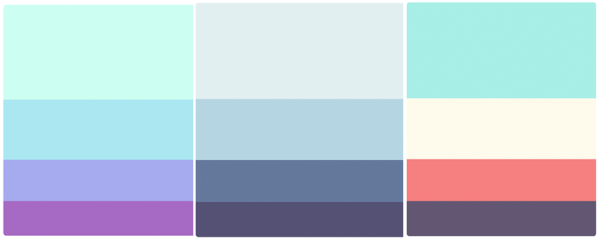
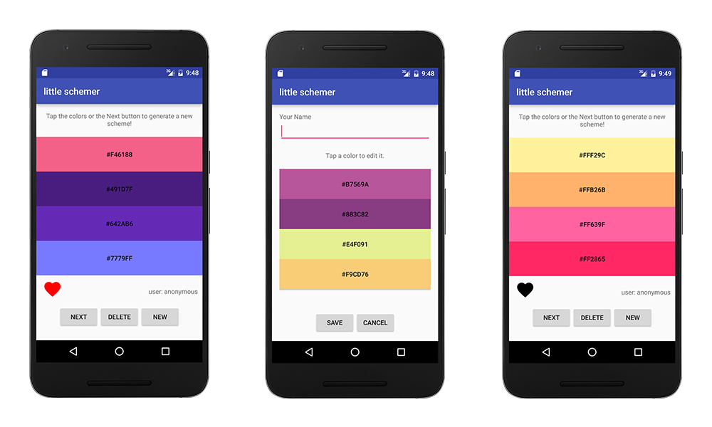

# the little schemer

The little schemer is an application that gives you beautiful colour schemes as well as ways to add your own colour schemes.

All default colour schemes are from [colorhunt](http://colorhunt.co).

### Screenshots

Below is a set of screenshots of what the main application looks like.

### What for?

This is an Android application for my college assignment.

### How?

Open the project folder: `android > LittleSchemer` in Android Studio, and hit the run button.

There are essentially two applications (questions) embedded in one.

**Question 1** is file based while **question 2** uses an SQLite DB.

### Clojure?

In the folder `little-schemer > clojure` there is very basic clojure code. I used clojure to scrub the data from [colorhunt](http://colorhunt.co), because clojure is awesome at doing this.